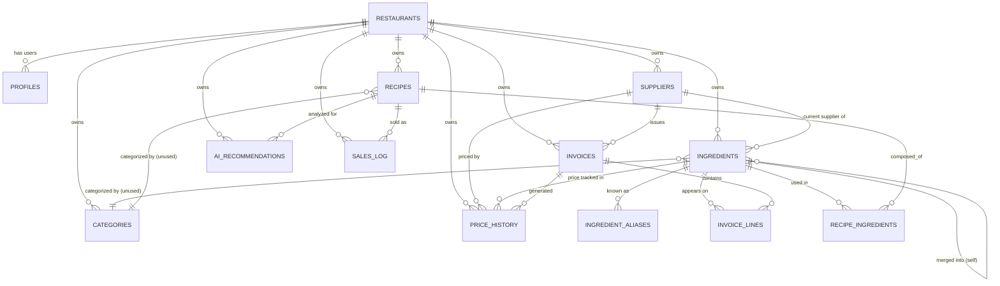

# Margin — Entity Relationship Map

Companion to [`DATABASE_MAP.md`](DATABASE_MAP.md). This focuses on ownership and dependency direction, not column-level detail.

## Diagram (Mermaid)



## Ownership Chain (who can never exist without whom)

```
restaurant
 ├─ profile           (cascade-deletes with restaurant)
 ├─ category           (cascade-deletes with restaurant)
 ├─ supplier            (cascade-deletes with restaurant)
 │   ├─ invoice          (cascade-deletes with restaurant; supplier_id is nullable, not cascaded from supplier)
 │   │   └─ invoice_line   (cascade-deletes with invoice)
 │   └─ ingredient        (current-supplier link only — not ownership)
 ├─ ingredient          (cascade-deletes with restaurant)
 │   ├─ ingredient_alias  (cascade-deletes with ingredient)
 │   ├─ price_history     (cascade-deletes with ingredient AND with restaurant)
 │   └─ recipe_ingredient (RESTRICT — an ingredient used in a recipe cannot be hard-deleted)
 └─ recipe              (cascade-deletes with restaurant)
     ├─ recipe_ingredient (cascade-deletes with recipe)
     ├─ ai_recommendation (cascade-deletes with recipe)
     └─ sales_log         (cascade-deletes with recipe)
```

The one deliberate guardrail in the schema is `recipe_ingredients.ingredient_id ... on delete restrict` — Postgres itself blocks deleting an ingredient that's in active use by a recipe. **This is currently the only hard-delete protection in the database.** `price_history` is append-only by convention/discipline (the app code never issues an UPDATE/DELETE against it), not by a DB-level constraint (no `BEFORE UPDATE/DELETE` trigger rejects it). That's worth closing before Sprint 05/06 add more write paths — see Technical Debt Report.

## Dependency Direction for Sprint 05 / 06

- **Menu Intelligence (Sprint 05)** will need a new top-level entity (`menu_items` or similar) that sits **above** `recipes`, not below — per the README's rule "do not auto-generate recipes from menu upload." This means menu items can exist with zero linked recipe initially, and get connected later. No existing entity currently models "a sellable item with a price but no recipe yet" — `recipes.sale_price` assumes the recipe exists.
- **Supplier Intelligence (Sprint 06)** is almost entirely additive on top of `suppliers` + `price_history`, which already carry everything needed (price points over time, per-supplier). No new core entity is obviously required — likely just new read-side aggregation (health score, variation) computed from existing tables, possibly cached in a new `supplier_health_snapshots`-style table if computing it live becomes too slow.
